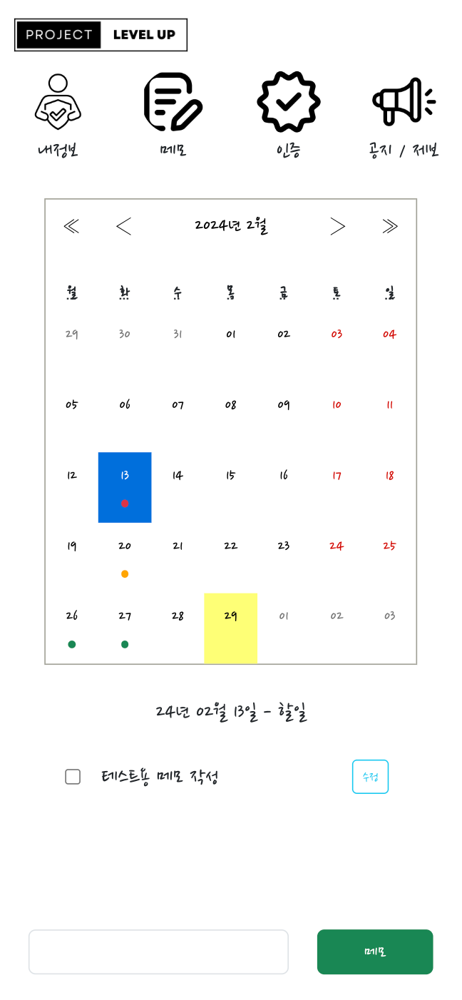
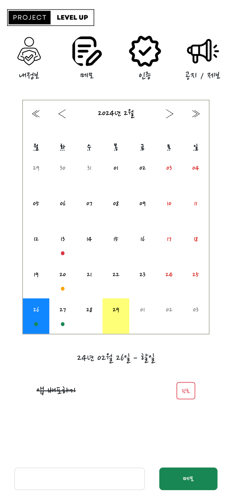
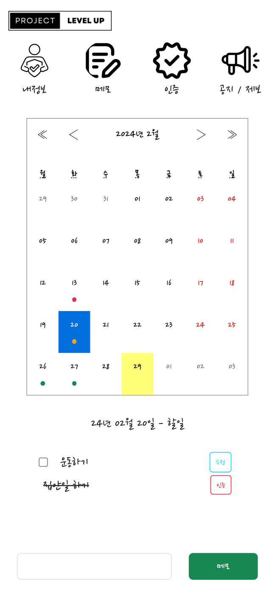
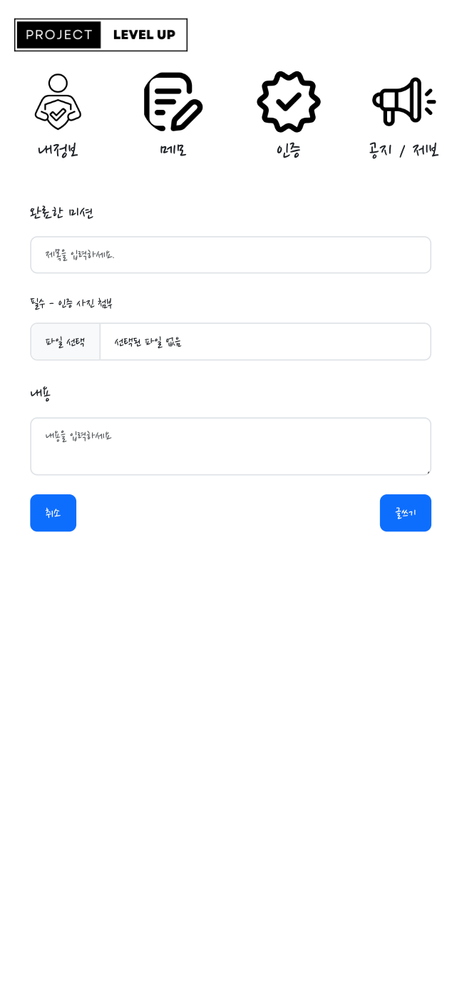
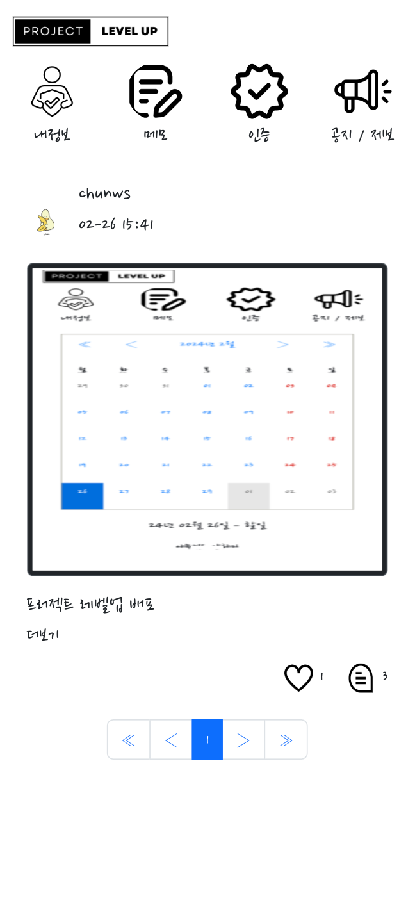
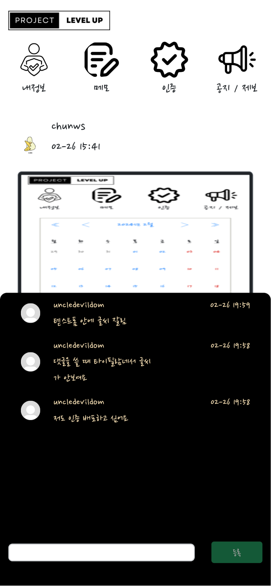
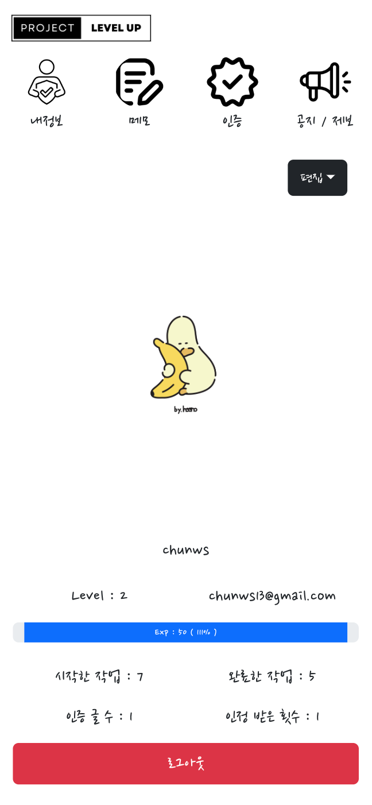

# Project :: Levup

[Proejct :: Levup 사이트](https://www.project-levup.site)

## 1. 프로젝트 소개
오늘의 할 일 수행을 통한 경험치 획득 및 레벨 업 시스템 도입으로 유저 관심 유도  
메모 습관화와 사이트 재방문 유도

## 2. 개발 정보

개발 기간 : 23. 12 ~   
`24. 02`
* 최초 버전 배포
* 모바일 Only 접근 가능

`24. 03`
* CI / CD 구현 (AWS EC2: git pull -> docker-compose)
* PC / Mobile 반응형 보기 적용
* 소셜 로그인 (카카오) 적용

## 3. 주요 기능 소개 (UI : Mobile)

1. 메모 관리 - 상단 "메모" 메뉴
    
     

    

    1-1. 작성 방법 
    
    

    * 등록 방법 

        1. 최하단 텍스트 박스에 메모 입력
        2. '메모' 버튼 클릭

    * 수정 방벙

        1. 완료 전 메모 우측 "수정" 버튼 클릭
        2. 메모 수정
        3. "저장" 버튼 클릭
    
    * 완료 방법

        1. 메모 좌측 체크박스 버튼 클릭
        2. 메모 표기 변경 (일반 텍스트 -> 취소선)
        3. 완료 메모 추가 수정 및 삭제 불가

     
    

    

    1-2 .상태   
    
    

    
    * 캘린더 색상 별 설명 

        * 적색 (ex. 13일) : 등록한 메모를 모두 완료하지 못함
        * 황색 (ex. 20일) : 등록한 메모 중 최소 1개 왼료함
        * 녹색 (ex. 27일) : 등록한 메모를 모두 완료함
    
     

2. 인증글 작성 - 상단 "메모" 메뉴

     
    

    
    
    

    * 작성 방법
        * 좌측 이미지

            1. 메모 완료 버튼 (체크 박스) 클릭
            2. "인증" 버튼 클릭
        
        * 우측 이미지

            3. 제목, 내용 작성 & 이미지 선택
            4. "글쓰기" 버튼 클릭
    
     

    * 인증 글 작성 시
        * 제목, 내용, 이미지 모두 필요

     

3. 좋아요 & 댓긆 작성 - 상단 "인증" 메뉴
     

    

    
    
    

    
    * 좋아요 기능 소개 - 좌측 이미지
        1. 게시글 하단 "하트" 버튼 클릭
        2. 재 클릭시 좋아요 취소

    * 댓글 기능 소개 - 우측 이미지
        1. 게시글 하단 "말풍선" 버튼 클릭
        2. 댓글 작성
        3. "등록" 버튼 클릭
    
     

4. 프로필 관리
    

    
    

    * 프로필 사진 변경 기능
        
        1. 우측 상단 "편집" 버튼 클릭
        2. 이미지 선택 / 프로필 삭제 버튼 클릭
        3. 별도 저장 확인 X, 즉시 적용
    
    * 레벨 및 경험치 시스팀
        
        1. 메모 완료 시 10 Exp 획득
        2. 인증글 좋아요 1회 발생 시 10 Exp 획득 (최초 1회)
        3. 경험치 100% 달성 시 레벨업

## 4. Backend
* Language
    * Python

* Library
    * FastAPI

* DB
    * MongoDB : 유저 / 메모 정보 저장
    * MySQL : 인증글, 좋아요, 댓글 정보 저장

* Infra
    * AWS EC2, ALB, S3

## 5. Frontend
* Language
    * HTML & CSS
    * Javascripts

* Library
    * React

* Infra
    * AWS S3

